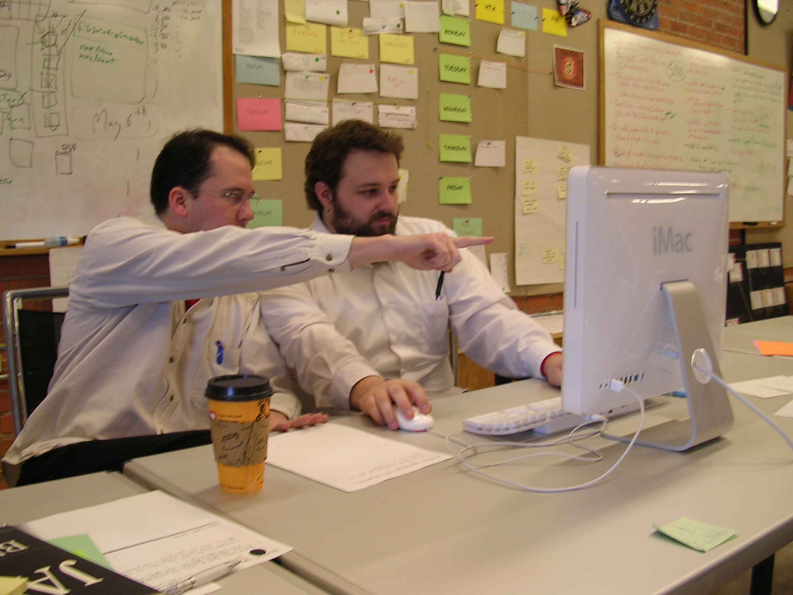

# Intro to Data Science and Machine Learning 
### @amitkaps | @bargava

---

# Welcome

---

# Facilitators

---

# Amit
## @amitkaps

---

# Bargava
## @bargava

---

# See the world through a data lens

---

# "Data is just a clue to the end truth"
-- Josh Smith

--- 

 

# Data Driven Decisions

---

# "Science is knowledge which we understand so well that we can teach it to a computer. Everything else is art" 
-- Donald Knuth

---

# Data Science is an Art

---

# Hypothesis Driven Approach

---

# Frame
## "An approximate answer to the right problem is worth a good deal"

---

# Acquire
## "80% perspiration, 10% great idea, 10% great output"

---

# Refine
## "All data is messy."

---

# Explore
## "I don't know, what I don't know."

---

# Model
## "All models are wrong, but some are useful"

---

# Insight
## "The goal is to turn data into insight"

---

---

## "Doing data analyis requires quite a bit of thinking and we believe that when you’ve completed a good data analysis, you’ve spent more time thinking than doing." 
-- Roger Peng

---

# Python Data Stack

---

# Case Studies

--- 
# Day 1
# Peeling the Onion
## Time Series Analysis

---

# Day 2
# Grocery 
## Market Basket Analysis / Collaborative Filter

---

# Day 2
# BanK Marketing
## Random Forest and Gradient Boosting

---

# Day 3
# DataTau
## Text Analytics

---

# Learning Approach

--- 

# Do the Exercises

---

# Pair up & Learn

---

# Call for Help

---

# Enjoy the workshop

---
 
# Github Repo 
### [https://github.com/amitkaps/machine-learning](https://github.com/amitkaps/machine-learning)

---

# Exercise

---

# 1. Time Series Exercise

### "Predict the number of tickets that will be raised in the next week"

- **Frame**: What to forecast? At what horizon? At what level?
- **Acquire, Refine, Explore**: Do EDA to understand the trend and pattern within the data
- **Models**: Mean Model, Linear Trend, Random Walk, Simple Moving Average, Exp Smoothing, Decomposition, ARIMA
- **Insight**: Share the insight through a datavis of the models

---

# 2. Text Analytics Exercise

### "Identify the entity, features and topics in the 'Comments Data' or "Twitter Data" within your text data"

- **Frame**: What are the comments you are trying to understand? 
- **Acquire, Refine, Explore**: Do Wordcloud, Lemmatization, Part of Speech Analysis, and Entity Chunking
- **Models**: TF-IDF, Topic Modelling, Sentiment Analysis
- **Insight**: Share the insight through word cloud and topic  visualisation

---

# Feedback

### [https://amitkaps.typeform.com/to/i6wl2E](https://amitkaps.typeform.com/to/i6wl2E)

---

# Recap

---

---

# Frame
- **Toy Problems**
- **Simple Problems**
- Complex Problems
- Business Problems
- Research Problems

---

# Acquire
- **Scraping** (structured, unstructured)
- **Files** (csv, xls, json, xml, pdf, ...)
- Database (sqlite, ...)
- APIs 
- Streaming

---

# Refine
- Data Cleaning (inconsistent, missing, ...)
- **Data Refining** (derive, parse, merge, filter, convert, ...)
- **Data Transformations** (group by, pivot, aggregate, sample, summarise, ...)

--- 

# Explore
- **Simple Vis**
- Multi Dimensional Vis
- Geographic Vis
- Large Data Vis (Bin - Summarise - Smooth)
- Interactive Vis

---

# Model - Supervised Learning 
- *Continuous*: Regression - **Linear**, Polynomial, Tree Based Methods - CART, **Random Forest**, Gradient Boosting Machines
- *Classification* - **Logistics Regression**, Tree, KNN, SVM, Naive-Bayes, Bayesian Network

---

# Model - UnSupervised Learning 
- *Continuous*: Clustering & Dimensionality Reduction like PCA, SVD, MDS, K-means
- *Categorical*: Association Analysis

---

# Model - Advanced /
- **Time Series**
- **Text Analytics**
- Network / Graph Analytics
- Optimization

---

# Model - Specialized
- Reinforcement Learning
- Online Learning
- Deep Learning
- Other Applications: Image, Speech 

---

# Insight
- Narrative Visualisation
- Dashboard Visualisation
- Decision Making Tools
- Automated Decision Tools

---

# PyData Stack 
- **Acquire / Refine**: `Pandas, Beautiful Soup, Selenium, Requests, SQL Alchemy, Numpy, Blaze`
- **Explore**: `MatPlotLib, Seaborn, Bokeh, Plotly, Vega, Folium`
- **Model**: `Scikit-Learn, StatsModels, SciPy, Gensim, Keras, Tensor Flow, PySpark`
- **Insight**: `Django, Flask`

---

# Skills

---

---

# Books

---

---

## Resources - Statistical Learning
- One of the good books on statistical learning is ISLR -> [An Introduction to Statistical Learning with Application in R](http://www-bcf.usc.edu/~gareth/ISL/index.html)
- You can find all the ISLR code in python at this github repo - [https://github.com/JWarmenhoven/ISLR-python](https://github.com/JWarmenhoven/ISLR-python)

---

## Resources - Time Series
- [Forecasting: Principle and Text](https://www.otexts.org/fpp)
- [Statistical forecasting: Notes on regression and time series analysis Case](http://people.duke.edu/~rnau/411home.htm)

## Resources - Text Analytics
- [Natural Language Processing with Python](http://www.nltk.org/book/)

---

# Online Course
- Harvard Data Science Course - [CS 109 Course](http://cs109.github.io/2015/) (It is structured in similar way to the approach we shared)
- Data Science Specialisation - [JHU Data Science](https://www.coursera.org/specializations/jhu-data-science) (It is a good course, though the material is coded in R)
 
- Many more on Coursera & Udacity...

---

---

# Speak to Us!

---

# Thank you
## @amitkaps | @bargava